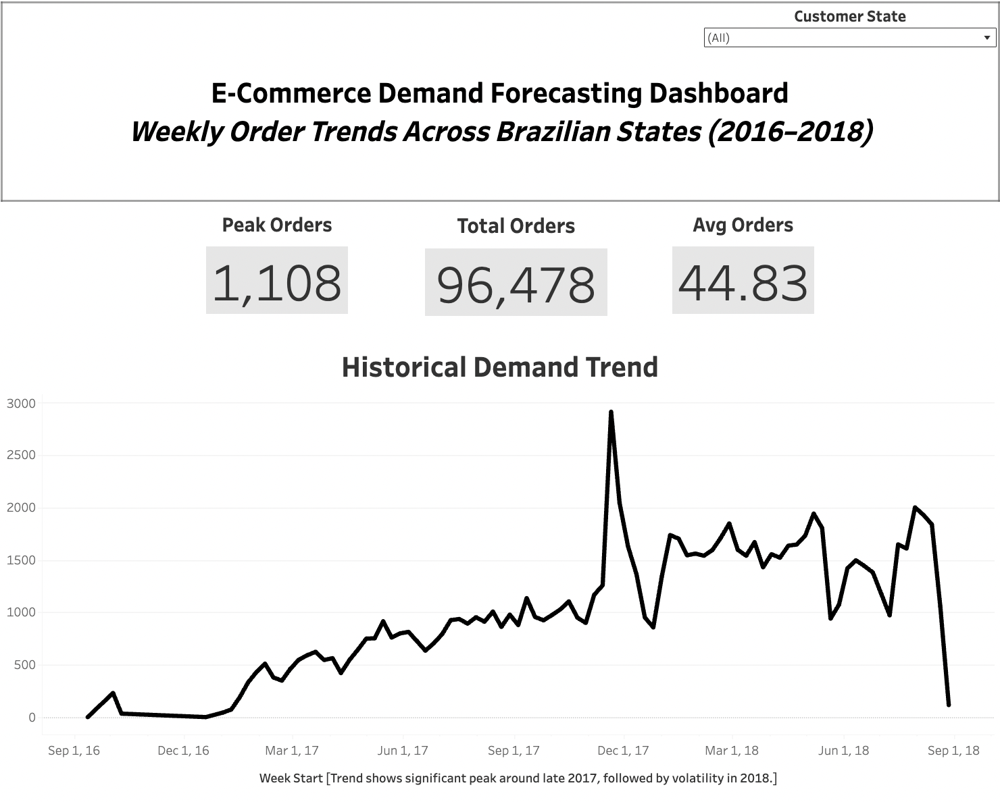
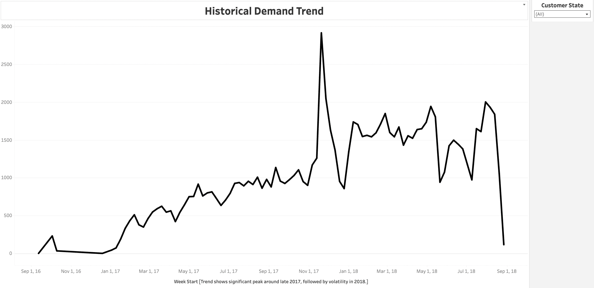

# E-Commerce Demand Forecasting Pipeline

This project demonstrates an end-to-end data pipeline built using AWS, Python, and Tableau to analyze and visualize weekly e-commerce demand trends across Brazilian states (2016–2018).

## Architecture

S3 → Athena → Python (ETL) → Tableau Dashboard

## Technologies Used

* **AWS S3** – Data storage
* **AWS Athena** – SQL-based data querying
* **Python** – Data processing and transformation
* **Tableau** – Data visualization and dashboard creation

## Project Workflow

1. **Data Storage**

   * Uploaded raw dataset to AWS S3 bucket

2. **Data Querying**

   * Queried data using AWS Athena with SQL

3. **Data Processing (Python)**

   * Cleaned and transformed dataset
   * Prepared data for analysis and visualization

4. **Visualization**

   * Built an interactive Tableau dashboard
   * Created KPI metrics and trend analysis

## Dashboard Overview

### Main Dashboard



### KPI Summary


### Trend Analysis



## Key Metrics

* **Total Orders:** 96,478
* **Average Weekly Orders:** 44.83
* **Peak Weekly Orders:** 1,108

## Key Insights

* Significant demand spike observed in late 2017
* Increased volatility in 2018
* Weekly seasonal demand patterns identified

## Note

Due to academic platform restrictions, the live Tableau dashboard is hosted in a private environment. Screenshots are provided instead.

## Key Takeaways

* Built a cloud-based data pipeline using AWS
* Applied data transformation using Python
* Developed business-focused data visualizations
* Gained hands-on experience with end-to-end data workflows

## Project Structure

```
ecommerce-demand-forecasting/
│
├── dashboard/
│   ├── dashboard.png
│   ├── kpi.png
│   └── trend.png
│
├── python/
│   └── etl_pipeline.py
│
├── data/
│   └── sample_dataset.csv
│
└── README.md
```

## Author
**Husna Bayraktar**
Master’s Student – Informatics (Cloud Computing)
Northeastern University

---
